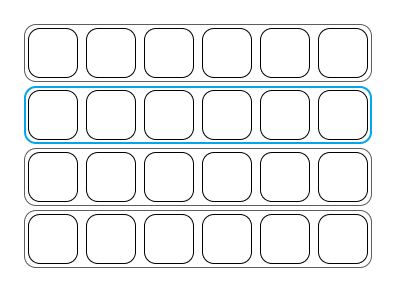

# Docs for developers

## The keyboard

### Presentation

The keyboard simulated here is composed `Keys` which are grouped into `Blocks` for easier navigation.

It is controlled using a single cursor and a button. The cursor will move automatically going from block to block until the user presses the button. The cursor will then move from key to key inside the selected block until the button is pressed again, entering the selected key.

### How it works

There are two types of events : `activation`, and `validation`. They can occur for both blocks and keys.